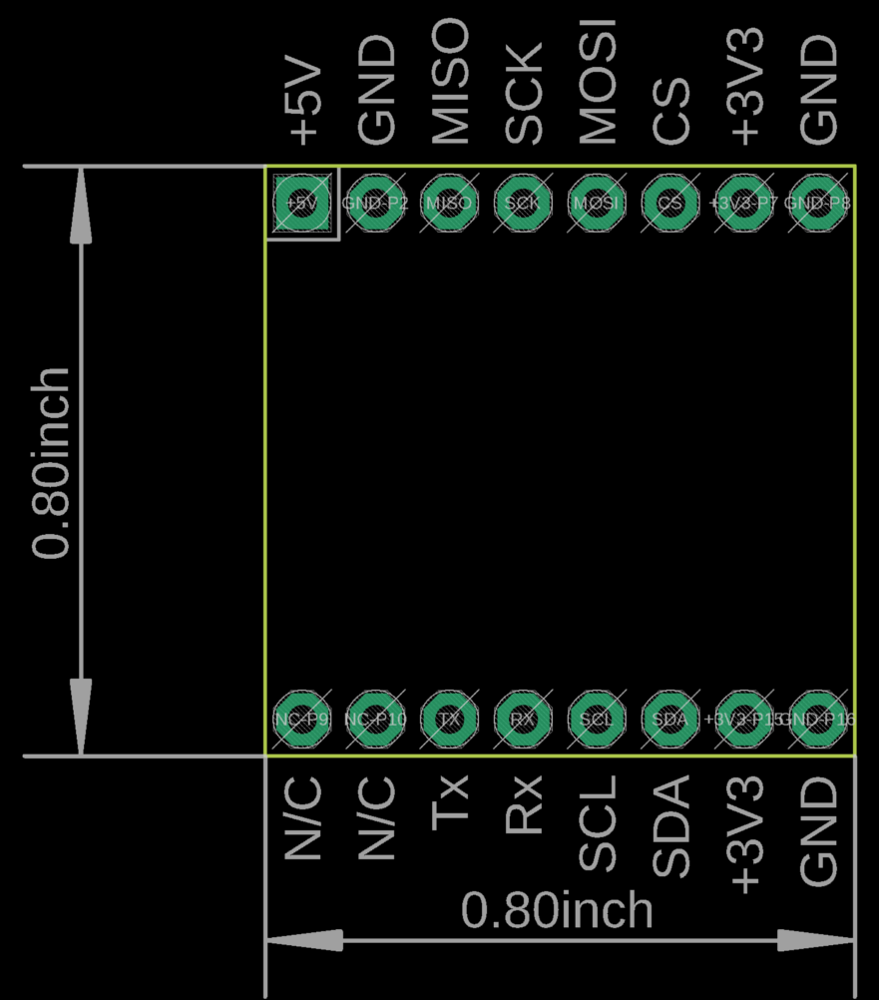

# SAINTCON Minibadge

### Version 2.0  



## A New Minibadge Standard ##

The Saintcon Badge Team presents the new minibadge spec.

Changes:
- Added the CLK pin.
- Added dedicated pins for programming microcontrollers on the minibadge.
- Removed SPI data bus (It was never supported.)
- Change +5V to +VBATT to more accurately reflect usage. This pin can be anywhere from +5v to +3.3v volts.

## +VBATT ##
This pin can operate anywhere from +5v to +3.3v. You can use it if you want your LEDs to be a little brighter, __Make sure they can
handle the current__. In recent years it has been at lipo battery voltage ~4v. There have been discussions to make it 3.3v, but to
keep backwards compatibility with other badges we advise if you use it to allow it to run up to 5v.

__DO NOT CONNECT IT TO 3.3v__

## CLK ##
This pin is controlled via the badge and pulses around 1 to 10 Hz. This can be useful to sync minibadge updates and
allow minibadges to have more elaborate functionality without needing to create their own clock.

## I2C ##
There have occasionally been issues with how the badge communicates with minibadges. To prevent this there is now a standard
for how to use I2C communication.

__NOTE: I2C minibadges should act like a sequential read ROM. Communication will start and stop multiple times for each message so
microcontrollers will need to keep track of the current state and what to send outside the event functions.__

All communication between the badge and a minibadge will initiate communication by sending `0x00` followed by either `0x00`(for write)
or `0x01` (for read) to the minibadge then read one byte.

##### Reading #####
During initiating communication the single read byte should be one of the options below. If the option requires more information,
like the text (0x02), then there can be multiple reads (like text one to get message length then a new read to get the message.)

* 0x00: Do nothing.
* 0x01: Button Pressed. (The minibadge will need to clear this or the badge will continue to show button pressed.)
* 0x02: Text. (The next byte is the length of the message Max value 0xFF followed by the ascii message.)

Ex:
```
[ 0bXXXXXXX1 0x00 0x01 ]  // Init Communication.
[ 0bXXXXXXX0 r ]          // The single byte read for choosing the read option.
[ 0bXXXXXXX0 r...]        // Any additional information needed by the badge. This may or may not start and stop reading multiple times. Or it may not be used at all.
```
* _[ = start of message_
* _] = end of message_
* _r = one byte read request_
* _0bXXXXXXX = 7-bit I2C address. A 1 following this is a write and a 0 is read._

##### Write #####
During initiating communication the single byte sent should be a 1 to indicate support for write requests or 0 to
indicate that the minibadge does not support writing. This will be followed by another single write with the message.

* 0x01 Score Update. (Then two bytes with the score.)
* 0x02 Brightness. (Then one more byte to set the brightness: 0x0 to 0x7F)

Ex:
```
[ 0bXXXXXXX1 0x00 0x00 ]    // Init Communication.
[ 0bXXXXXXX0 r ]            // The one byte read to check if the minibadge supports writing.
[ 0bXXXXXXX1 0xXX 0xXX...]  // This will write the command followed by any necessary data. This will be a single write.
```

----

__A more detailed explanation for each command can be found in [I2C Example Code](/I2C%20Example%20Code/README.md).__

If you would like to use I2C for a minibadge there will be an official list of used addresses. If you would like to
reserve an address open a pull request with the 7-bit address so it can be added.

## PROG ##
These pins will never be connected to the badge and can be used how ever you want to use them. They are meant for
a useful drop in place programming pinout.

Here are some optional guides:

| Type        | Pin 3 | Pin 4 | Pin 5 | Pin 6 |
|-------------|-------|-------|-------|-------|
| AVR ISP     | MISO  | CLK   | MOSI  | RESET |
| ST-Link SWD | SWIM  | SWCLK | SWDIO | RESET |
| PIC ICSP    | PGM   | PGC   | PGD   | MCLR  |
| UART        | RX    | DTR   | TX    | RTS   |


## NC ##
These pins are reserved for future use. Do not connect anything including themselves to them as this may cause damage to either
minibadges, the host badge, or both.

------

This library is provided as is. Use at your own risk.  

**Licensing:** Creative Commons ShareAlike 4.0 International - https://creativecommons.org/licenses/by-sa/4.0/  
